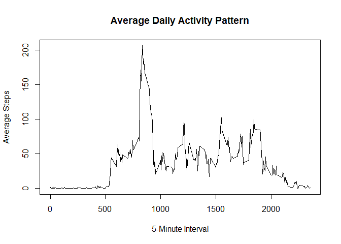
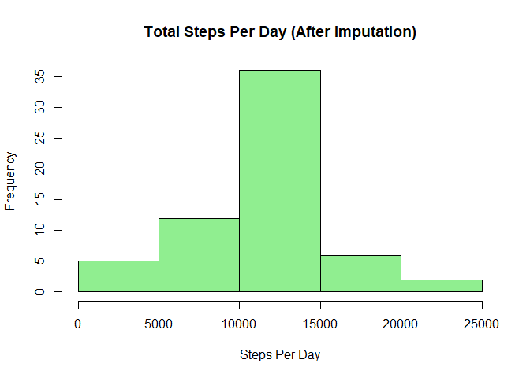
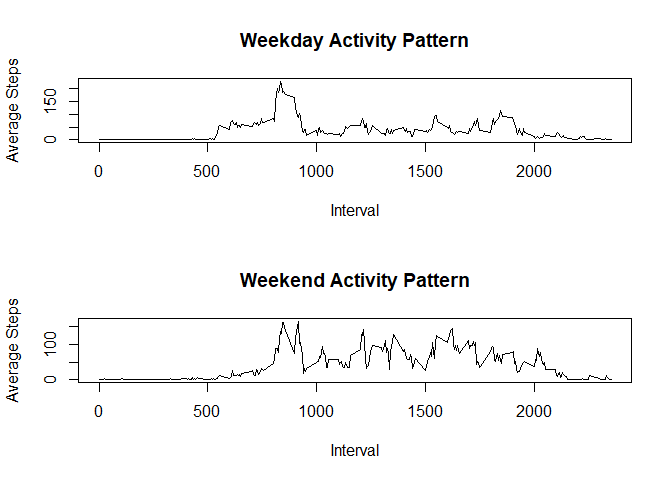

## Loading and preprocessing the data

``` r
# Load the data
data <- read.csv("activity/activity.csv")
data$date <- as.Date(data$date)


## What is mean total number of steps taken per day?
```

``` r
steps_per_day <- aggregate(steps ~ date, data = data, sum, na.rm = TRUE)
head(steps_per_day)
```

```
##         date steps
## 1 2012-10-02   126
## 2 2012-10-03 11352
## 3 2012-10-04 12116
## 4 2012-10-05 13294
## 5 2012-10-06 15420
## 6 2012-10-07 11015
```

``` r
mean_steps <- mean(steps_per_day$steps)
median_steps <- median(steps_per_day$steps)

mean_steps
```

```
## [1] 10766.19
```

``` r
median_steps
```

```
## [1] 10765
```

## What is the average daily activity pattern?

``` r
interval_avg <- aggregate(steps ~ interval,
                          data = data,
                          mean,
                          na.rm = TRUE)

head(interval_avg)
```

```
##   interval     steps
## 1        0 1.7169811
## 2        5 0.3396226
## 3       10 0.1320755
## 4       15 0.1509434
## 5       20 0.0754717
## 6       25 2.0943396
```

``` r
plot(interval_avg$interval,
     interval_avg$steps,
     type = "l",
     xlab = "5-Minute Interval",
     ylab = "Average Steps",
     main = "Average Daily Activity Pattern")
```

<!-- -->

``` r
max_interval <- interval_avg$interval[which.max(interval_avg$steps)]
max_interval
```

```
## [1] 835
```


## Imputing missing values

``` r
sum(is.na(data$steps))
```

```
## [1] 2304
```

``` r
data_filled <- data

interval_means <- interval_avg$steps
names(interval_means) <- interval_avg$interval

for(i in 1:nrow(data_filled)){
  if(is.na(data_filled$steps[i])){
    data_filled$steps[i] <- interval_means[as.character(data_filled$interval[i])]
  }
}
```

``` r
steps_per_day_filled <- aggregate(steps ~ date,
                                  data = data_filled,
                                  sum)

hist(steps_per_day_filled$steps,
     main = "Total Steps Per Day (After Imputation)",
     xlab = "Steps Per Day",
     col = "lightgreen")
```

<!-- -->

``` r
mean(steps_per_day_filled$steps)
```

```
## [1] 10766.19
```

``` r
median(steps_per_day_filled$steps)
```

```
## [1] 10766.19
```


## Are there differences in activity patterns between weekdays and weekends?

``` r
data_filled$day_type <- ifelse(weekdays(data_filled$date) %in%
                                 c("Saturday", "Sunday"),
                               "weekend",
                               "weekday")

data_filled$day_type <- as.factor(data_filled$day_type)
```

``` r
interval_daytype <- aggregate(steps ~ interval + day_type,
                              data = data_filled,
                              mean)
```

``` r
par(mfrow = c(2,1))

weekday_data <- subset(interval_daytype, day_type == "weekday")
weekend_data <- subset(interval_daytype, day_type == "weekend")

plot(weekday_data$interval,
     weekday_data$steps,
     type = "l",
     main = "Weekday Activity Pattern",
     xlab = "Interval",
     ylab = "Average Steps")

plot(weekend_data$interval,
     weekend_data$steps,
     type = "l",
     main = "Weekend Activity Pattern",
     xlab = "Interval",
     ylab = "Average Steps")
```

<!-- -->
